<p align="center">
  
</p>

<p align="center">
  
</p>

<p align="center">
  
</p>

## `> boot_sequence`

```text
[ OK ] identidade carregada
[ OK ] ambiente de estudos inicializado
[ OK ] projetos privados montados
[ OK ] modo de aprendizado contínuo ativado
[ OK ] documentação e validação em execução
```

## `> whoami`

```bash
$ cat joseph.profile

nome="Joseph Alexsander"
formacao="Análise e Desenvolvimento de Sistemas"
foco_atual=("C" "Python" "bancos de dados" "dados" "web")
interesses=("Inteligência Artificial" "automação" "produtos digitais")
objetivo="primeira oportunidade profissional em tecnologia"
metodo_de_trabalho="planejar -> construir -> validar -> documentar"
```

Sou estudante de **ADS** e gosto de investigar como softwares e produtos digitais funcionam por trás da interface. Aprendo construindo: desenvolvo projetos próprios, organizo decisões e valido cada etapa para transformar ideias em soluções que possam evoluir com segurança.

## `> current_mission`

```text
CURRENT_MISSION
├── fortalecer minha base em desenvolvimento de software
├── transformar estudos em projetos práticos e documentados
├── evoluir em desenvolvimento web, dados e Inteligência Artificial
├── validar ideias antes de publicá-las
└── conquistar minha primeira oportunidade profissional em tecnologia
```

## `> processes --status`

A maior parte dos meus projetos principais permanece em repositórios privados enquanto passa por construção, documentação e validação. As descrições abaixo são intencionalmente gerais para não expor arquitetura, estratégias ou diferenciais internos.

```text
[CORE]     Argus Black
           Projeto privado de longo prazo relacionado a automação e IA.

[ACTIVE]   SCK Assistant
           Experimentos privados com assistência digital e produtividade.

[ACTIVE]   Sites Base Profissionais
           Estrutura privada para experiências web comerciais e landing pages.

[ACTIVE]   Central de Conteúdo
           Plataforma privada voltada à organização de fluxos de conteúdo.

[LAB]      Outros projetos
           Aplicativos, ferramentas e ideias em estudo ou validação.
```

## `> stack --list`

<p align="center">
  
</p>

<p align="center">
  
  
  
  
</p>

## `> github --stats`

<p align="center">
  
  
</p>

<p align="center">
  
</p>

## `> contato --open`

<p align="center">
  <a href="https://www.instagram.com/sck_alex77?igsh=MWtxaGc5M3BjdTc4">
    
  </a>
  <a href="mailto:josephkrescher@gmail.com">
    
  </a>
</p>

<p align="center">
  
</p>
