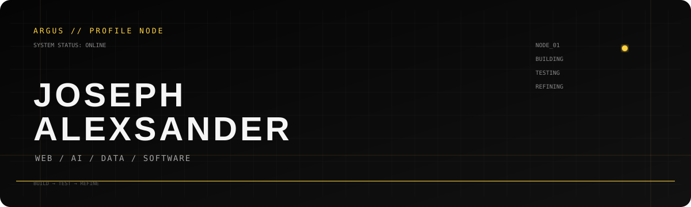
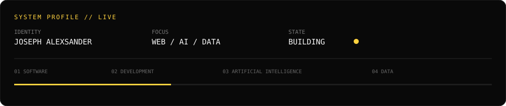
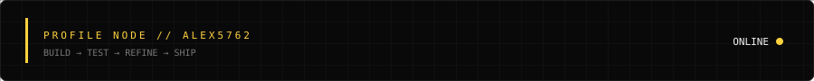

<p align="center">
  
</p>

<p align="center">
  <a href="https://github.com/Alex5762"></a>
  <a href="mailto:josephkrescher@gmail.com"></a>
  <a href="https://www.instagram.com/sck_alex77"></a>
</p>

## SYSTEM PROFILE

<p align="center"></p>

> Estudante de **Análise e Desenvolvimento de Sistemas**, construindo projetos na interseção entre **software, web, dados e Inteligência Artificial**.

Não uso o GitHub apenas como vitrine. Ele funciona como registro do processo: **construir → testar → validar → refinar → documentar**.

## CURRENT OPERATIONS

```text
[01] WEB DEVELOPMENT
     Interfaces responsivas · sites leves · Astro · HTML · CSS · JavaScript

[02] ARTIFICIAL INTELLIGENCE
     IA generativa · automação · experimentação · aplicações práticas

[03] DATA & DATABASES
     Python · Pandas · PostgreSQL · análise de dados · Jupyter

[04] SOFTWARE ENGINEERING
     Programação · organização de projetos · versionamento · documentação

[05] PRODUCT BUILDING
     Transformar ideias em sistemas e experiências que possam ser testados no mundo real
```

## PROJECT INTELLIGENCE

| PROJECT | STATUS | SCOPE |
| --- | --- | --- |
| **ARGUS BLACK** | `PRIVATE / CORE` | Software, automação e Inteligência Artificial |
| **SCK ASSISTANT** | `PRIVATE / LAB` | Assistência digital e produtividade |
| **SITES BASE PROFISSIONAIS** | `PRIVATE / ACTIVE` | Desenvolvimento de experiências web comerciais |
| **CENTRAL DE CONTEÚDO** | `PRIVATE / ACTIVE` | Organização e gerenciamento de fluxos de conteúdo |

> Projetos privados permanecem descritos apenas em nível conceitual. Arquitetura, estratégias e diferenciais internos não fazem parte desta vitrine.

### PROJECT RESULT // SITE BASE

<p align="center"></p>

Um exemplo prático do objetivo do **Sites Base Profissionais**: transformar uma base reutilizável em uma experiência comercial funcional, passando por **construção, teste e validação** em um fluxo curto.

> **15 minutos.** Um site construído, testado e validado — do primeiro passo ao resultado funcional.

## STACK // CORE

<p align="center"></p>

<p align="center">
  
  
  
</p>

## GITHUB ACTIVITY

<p align="center">
  
</p>

<p align="center">
  <sub>LIVE CONTRIBUTIONS · CODE · PROJECTS · EXPERIMENTATION</sub><br/>
  <a href="https://github.com/Alex5762">VIEW PROFILE ACTIVITY →</a>
</p>

## LEARNING LOG

```text
01  Desenvolvimento de software
02  Desenvolvimento web
03  Python e análise de dados
04  PostgreSQL e bancos de dados
05  Inteligência Artificial
06  Arquitetura e organização de projetos
07  Automação e produtos digitais
```

## PRINCIPLE

```text
BUILD       → transformar ideia em algo executável
TEST        → descobrir o que funciona na prática
REFINE      → remover complexidade e corrigir falhas
DOCUMENT    → deixar o conhecimento reutilizável
```

<p align="center"><strong>BUILD → TEST → REFINE</strong><br/><sub>JOSEPH ALEXSANDER · SOFTWARE / WEB / AI / DATA</sub></p>

<p align="center">
  
</p>
