<p align="center">
  
</p>

<p align="center">
  
</p>

<p align="center">
  
</p>

## 👨‍💻 Sobre mim

Sou estudante de **Análise e Desenvolvimento de Sistemas**, apaixonado por entender como a tecnologia funciona por trás das interfaces. Meu foco atual passa por programação, bancos de dados, análise de dados, desenvolvimento web e experimentação prática com Inteligência Artificial.

```text
Nome ............. Joseph Alexsander
Formação ......... Análise e Desenvolvimento de Sistemas
Foco atual ....... C, Python, bancos de dados, dados e web
Interesses ....... IA, automação, produtos digitais e landing pages
Objetivo ......... Primeira oportunidade profissional em tecnologia
Método ........... planejar → construir → validar → documentar
```

## 🎯 Missão atual

```text
CURRENT_MISSION
├── fortalecer minha base em desenvolvimento de software
├── transformar estudos em projetos práticos e bem documentados
├── evoluir em desenvolvimento web, dados e Inteligência Artificial
├── validar ideias com responsabilidade antes de publicá-las
└── conquistar minha primeira oportunidade profissional em tecnologia
```

## 🚀 Projetos em desenvolvimento

A maior parte dos meus projetos principais permanece em repositórios privados enquanto passa por construção, documentação e validação. As descrições abaixo são intencionalmente gerais para não expor arquitetura, estratégias ou diferenciais internos.

```text
[CORE]     Argus Black
           Projeto privado de longo prazo relacionado a automação e IA.

[ACTIVE]   SCK Assistant
           Experimentos privados com assistência digital e produtividade.

[ACTIVE]   Sites Base Profissionais
           Estrutura privada para desenvolvimento de experiências web comerciais.

[ACTIVE]   Central de Conteúdo
           Plataforma privada voltada à organização de fluxos de conteúdo.

[LAB]      Outros projetos
           Aplicativos, ferramentas e ideias em estudo ou validação.
```

## 🧰 Tecnologias e ferramentas

<p align="center">
  
</p>

<p align="center">
  
  
  
  
</p>

## 📊 Atividade no GitHub

<p align="center">
  
  
</p>

<p align="center">
  
</p>

## 📫 Contato

<p align="center">
  <a href="https://www.instagram.com/sck_alex77?igsh=MWtxaGc5M3BjdTc4">
    
  </a>
  <a href="mailto:josephkrescher@gmail.com">
    
  </a>
</p>

<p align="center">
  
</p>
